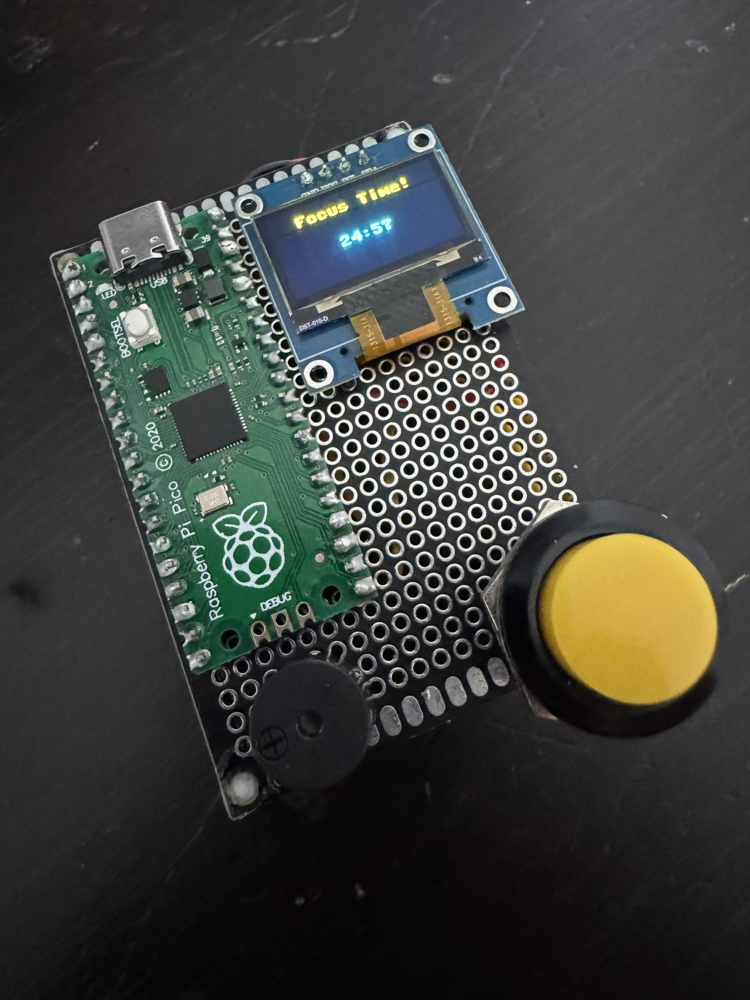

# Pico Pomodoro Timer

A very basic Raspberry Pi Pico Pomodoro timer using a 0.96 OLED or 20x4 I2C LCD, button, and buzzer.

## Current Version 
- Version 1.3 (OLED display)
- Click version number folder to get main.py file (this is the main program of the pomodoro timer) and make sure to get both libraries lcd_api.py and pico_i2c_lcd.py or the main program will not work. 

## Features
- 25-minute focus timer
- 5-minute break timer
- Button-controlled start/continue
- Buzzer alerts at the end of each timer
- Session count since power-on
- 20-second idle backlight shutoff on welcome/waiting screens

## Hardware
- Raspberry Pi Pico                   (I'm using a generic RP2040 clone with USB C)
- 0.96 Inch LCD                       (Standard 1 inch OLED from Ali Express)
- 20x4 I2C LCD with I2C backpack      (Standard I2C 20x4 LCD from AliExpress with I2C backpack for I2C communication protocol)
- Push button                         (Any typical electronics button will do)
- Active buzzer                       (Standard electronics buzzer from AliExpress)
- 5V USB power                        (Plugs directly into Pico for 5V power)

## Important Notes
- For the code to work you need to load the following onto microcontroller (Pico in this case):
  - For OLED:
      - ssd1306.py an an OLED driver library that lets the Pico communicate with the SSD1306 OLED display using I2C protocol (will be importing I2C specific library inside code)
  - For LCD:
      - lcd_api.py a general API library for code to communicate with LCD and display text/position text, clear screen, etc (not just I2C LCD's)
      - pico_i2c_lcd.py a Pico-specific I2C LCD driver library that lets the Pico communicate with the LCD through the I2C protocol backpack, which then controls the LCD display.
  - main.py the main program that runs on pico and is found in the version number folder
